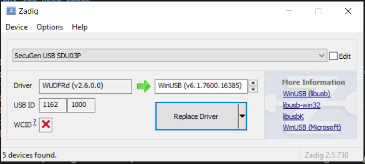
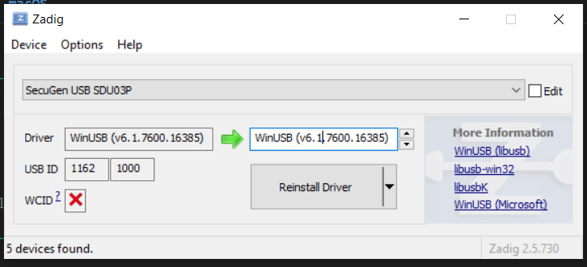

# SecuGen HU20 Fingerprint Scanner — WebUSB

A browser-based fingerprint capture application for the **SecuGen HU20** scanner. No SDK, no local software, no browser extension — the browser talks directly to the USB hardware using the [WebUSB API](https://developer.mozilla.org/en-US/docs/Web/API/WebUSB_API).

## How it works

WebUSB gives JavaScript direct access to USB devices. This app sends the same low-level USB control and bulk transfers that SecuGen's own SDK sends, reverse-engineered from USB packet captures (USBPcap + Wireshark). The capture sequence is:

1. Initialize ~50 sensor registers (brightness, gain, timing, image window)
2. Arm capture → read first bulk transfer (calibration / pre-capture frame)
3. Turn on LED, configure live-capture registers
4. Arm capture again → read second bulk transfer (669,184 bytes = 1,307 × 512-byte USB packets)
5. Decode the leading 300 × 400 greyscale pixels → render to canvas

## Browser support

| Browser | WebUSB | Works? |
|---------|--------|--------|
| Chrome 61+ | ✅ | Yes |
| Edge 79+ | ✅ | Yes |
| Firefox | ❌ | No |
| Safari | ❌ | No |

WebUSB is intentionally not supported by Firefox or Safari.

## Windows: why you need Zadig

This is the most important setup step on Windows.

The SecuGen SDK installs a **proprietary kernel driver** that binds to the HU20 device. When a device has a vendor driver, Windows blocks all other software — including WebUSB — from accessing it. The browser cannot claim the USB interface while SecuGen's driver owns it.

[Zadig](https://zadig.akeo.ie/) is a small open-source utility that replaces the driver bound to a specific USB device with **WinUSB**, Microsoft's generic USB driver. WinUSB is what WebUSB (and libusb) use to talk to hardware without a vendor driver.

### Steps

1. Download and run **[Zadig](https://zadig.akeo.ie/)** (no install needed).
2. Plug in the HU20 scanner.
3. In Zadig: **Options → List All Devices**, then select **SecuGen fingerprint reader** (or similar name, Vendor ID `0x1162`) from the dropdown.
4. Confirm the current driver shown. Common values:
   - `WUDFRd` — Windows User-Mode Driver Framework Reflector. This means Windows 10/11 claimed the device through its built-in **Windows Biometric Framework**. This is the most common case on modern Windows.
   - `SGFPLIB` or `usbccgp` — SecuGen's proprietary SDK driver.
   - In all cases, replace it with WinUSB.
5. Set the target driver to **WinUSB** and click **Replace Driver**.
6. Open Chrome/Edge and load the app — the Connect button will now work.



> **Note:** After replacing the driver, SecuGen's own SDK software will no longer recognize the device until you restore the original driver (which Zadig can also do). Keep that in mind if you switch between this app and SDK-based tools.

### Troubleshooting on Windows

**"No device selected"**
The browser's USB picker opened but was closed without selecting a device. Not an error — just open the picker again and select the scanner.

**"The browser finds the device but still can't connect — why?"**
USB device discovery and driver ownership are two separate things. The browser's device picker reads the USB bus enumeration list — a low-level OS registry of every physically connected USB device, regardless of what driver owns it. That is why the scanner appears in the picker. `claimInterface()` is a separate operation that goes through the driver layer and asks the OS for exclusive access. If any driver (WUDFRd, the Windows Biometric Service, or a stale handle from a previous session) still holds the device, the OS refuses — even though the browser can see it. Think of it like a file that is visible in Explorer but locked by another process.

**"Unable to claim interface"**
This means the device was selected but the browser couldn't take exclusive control of it. Work through these steps in order:

1. **Unplug and replug the scanner.** This is the most commonly missed step. After Zadig replaces the driver, Windows still holds an old handle to the device. The new WinUSB driver only fully takes effect on a fresh connection. Unplug the scanner, wait a few seconds, plug it back in, then click Connect again.

2. **Verify the driver replacement in Device Manager.** Open Device Manager (`Win + X → Device Manager`) and look for the HU20. After a successful Zadig replacement it should appear under **Universal Serial Bus devices** as something like "SecuGen fingerprint reader". If it still appears under **Biometric devices** or another category, Zadig did not fully apply — run Zadig again, making sure to select the correct device and WinUSB as the target driver.

3. **Close all other browser tabs** that previously connected to the scanner. A tab that connected but never called disconnect can leave the USB interface claimed, blocking a new connection. Close all tabs pointing to this app and reopen a fresh one.

4. **Reboot.** If none of the above work, reboot the machine, plug the scanner in fresh, and try again before opening any other software.

5. **Use the Force Connect button.** If normal connect still fails after all of the above, use the **Force Connect** button in the app. This issues a USB bus reset (`device.reset()`) — the software equivalent of physically unplugging and replugging. Windows re-enumerates the device and releases all existing kernel-level handles, including those from SecuGen SDK processes, stale browser sessions, or a Biometric Framework service that was stopped but not fully flushed. The debug log will show each step: open → USB reset → re-enumerate → claim interface.

> **Note:** There is no browser or JavaScript API that can identify which application is currently holding the USB interface. That information lives in the Windows kernel handle table. If you need to diagnose it at the OS level, use **USBView** (from the Windows SDK) or **Process Explorer** (Sysinternals) → Find Handle and search for the device path.

### Linux / macOS

No driver change needed. WebUSB works out of the box. On Linux you may need a udev rule to grant non-root access:

```
# /etc/udev/rules.d/99-secugen.rules
SUBSYSTEM=="usb", ATTR{idVendor}=="1162", MODE="0664", GROUP="plugdev"
```

Then `sudo udevadm control --reload-rules && sudo udevadm trigger`.

## Running the app

No build step. Serve from any local HTTP server (WebUSB requires `localhost` or HTTPS — `file://` is blocked):

```bash
npx serve .
# or
python -m http.server 8080
```

Then open `http://localhost:8080` (or whatever port) in Chrome or Edge.

## Project structure

```
index.html          Main UI
src/
  secugen.js        SecuGenScanner class — all USB protocol logic
  archive/          Original experimental HTML files (for reference)
```

## Known limitations

- The USB protocol was reverse-engineered and is not officially documented. Parameter semantics are partially understood.
- The bulk transfer data format (669,184 bytes) is not fully decoded. The app reads the first 120,000 bytes as a 300×400 greyscale image. If capture produces a black or noisy image, the offset into the buffer may need adjustment — use the **Debug log** panel and the `rawCapture()` method in `secugen.js` to inspect the raw bytes.
- No fingerprint matching or template extraction is performed — this app only captures and displays the raw image.
